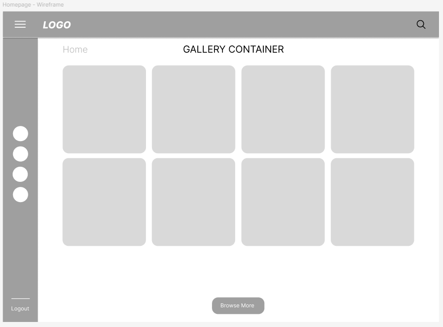
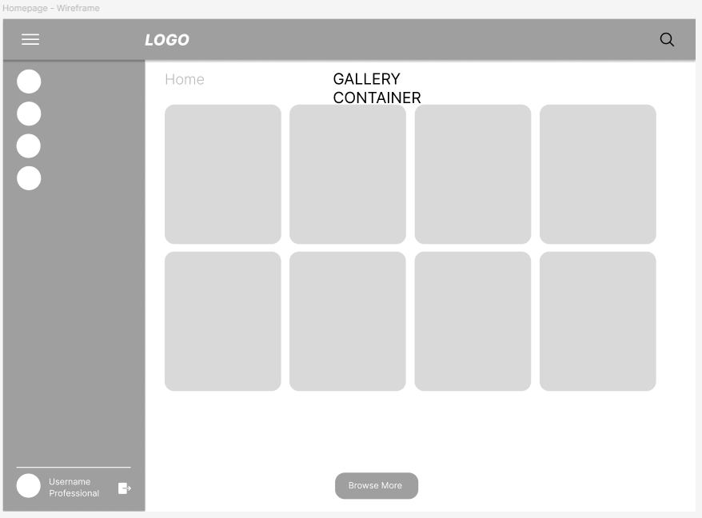

## User Stories

Exhibition designer Emily wants to view a gallery and search for art pieces from the Met API, so that she can can be inspired for future exhibitions.

Exhibition designer Emily wants a drag-and-drop artwork placement visualization tool so that she can plan her gallery walls.

Exhibition designer Emily wants to see all art in their relative sizes, so she can realistically place them.

Art curator Arman wants a separate website to be able to click a save button on Met art pieces so he can view a personal “saved” list.

Art curator Arman wants to be able to browse art within similar genres so that he can compare and contrast different pieces.

Art curator Arman wants to be able to compare details of pieces so that he can choose the perfect one for his clients.

*Stretch Stories*

Dreamer Desmond wants to be able to save placements so that he can show his father’s art curator what to purchase.

Dreamer Desmond wants to be able to customize wall sizing in the layout function so that he can visualize his mansion gallery walls filled with Met art.

# Exhibition Designer Emily

> "Designing spaces, crafting experiences.”
>

**About**

Emily is a driven exhibition designer in New York City with a keen eye for spatial storytelling. She dreams of owning her own gallery where she can curate immersive art experiences with ease. Frustrated by the lack of specialized tools for artwork placement, she’s always on the lookout for innovative solutions to streamline her workflow.

**Demographics**

- Age: 27
- Location: New York City, NY
- Job: Exhibition designer
- Income: $62k/year
- Family: Dog mom

**Goals**

- Own a gallery to put on her own art exhibits
- Easy artwork placement visualization

**Frustrations**

- Lack of specialized art placement tool
- Time consuming process

**Personality**

Practical, Self-sufficient, Artistic, Motivated

Exhibition designer Emily wants an artwork placement visualization tool so that she can plan her gallery walls.

Exhibition designer Emily wants to see all art in their relative sizes, so she can place them easily.

Exhibition designer Emily wants to be able to save placements so that she can use them for a portfolio for future cliental.

# Art Curator Arman

> "Bringing the Met to Cheyenne, one masterpiece at a time.”
>

**About**

Balancing the precision of curation with the unpredictability of life, this Cheyenne-based art curator brings a keen eye and a thoughtful approach to every exhibit. Whether selecting the perfect piece or managing joint custody of his two kids (and Tony the cat), he values both structure and spontaneity. With years of experience and a passion for storytelling through art, he strives to make every collection resonate on a deeper level.

Arman normally

Arman when thinking about accessing the Met website

**Demographics**

- Age: 38
- Location: Cheyenne, WY
- Job: Art curator
- Income: $110k/yr
- Family: Ex-wife, two kids (joint custody), Tony the cat

**Personality**

Thoughtful, discerning, organized, aesthetic sensibility

**Goals**

- Easily find details of Met art pieces
- Browse online through moods/genres to find the perfect piece

**Frustrations**

- Cheyenne is really far from New York, and he had a shared life with his ex-wife there so he does not want to return or access the [metmuseum.org](http://metmuseum.org) (where they spent a lot of shared time).
- Even if he had access, the [metmuseum.org](http://metmuseum.org) does not have a save functionality for pieces he is interested in

Art curator Arman wants a separate website to be able to click a save button on Met art pieces so he can curate a personal list.

Art curator Arman wants to be able to browse art within similar genres so that he can compare and contrast different pieces.

Art curator Arman wants to be able to compare details of pieces so that he can choose the perfect one for his clients.

# Dreamer Desmond (Wegenke)

> "Power, prestige, and perfectly curated art.”
>

**About**

A mastermind in the making, this 15-year-old Houston native has big plans—world domination, a mansion worthy of his status, and, of course, walls adorned with priceless Met masterpieces. As the son of a famous tech billionaire, he has the resources, the intellect, and just enough mischief to make things interesting. While he’s still refining his villainous empire, one thing is certain—Mrs. Kipling the Lizard will rule by his side.

**Demographics**

- Age: 15
- Location: Houston, Texas
- Job: Student, aspiring supervillain
- Income: $0k/yr
- Family: Famous tech billionaire’s son, 15 siblings, Mrs. Kipling the Lizard

**Goals**

- Rule the world and fill his Texan mansion with Met gallery art

**Frustrations**

- No mansion yet, unsure how the art would look on his walls

**Personality**

Theatrical, ambitious, mischievous, entitled

Dreamer Desmond wants to be able to customize wall sizing in the layout function so that he can visualize his mansion gallery walls filled with Met art.

# Wireframes

# Kaban Board

Follow this link to view our [Kaban](https://www.notion.so/Project-2-Art-Gallery-1ab3d40b29328027aecbe1ec0448d56a?pvs=4)